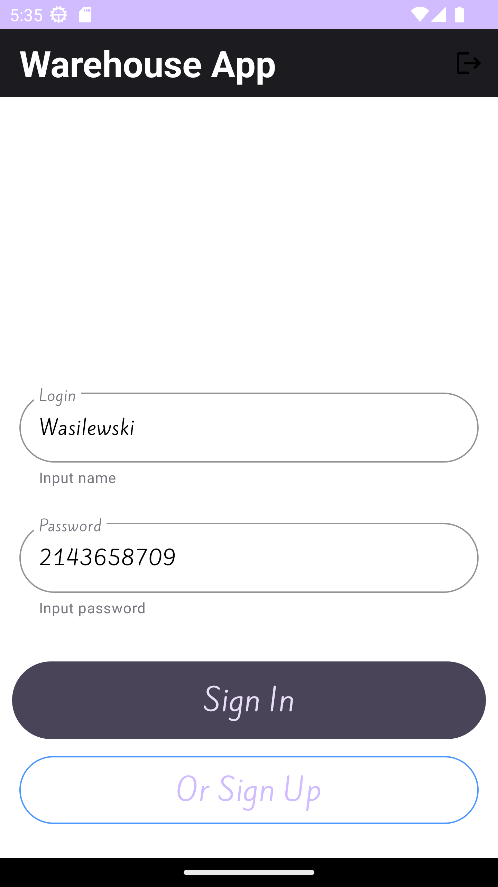
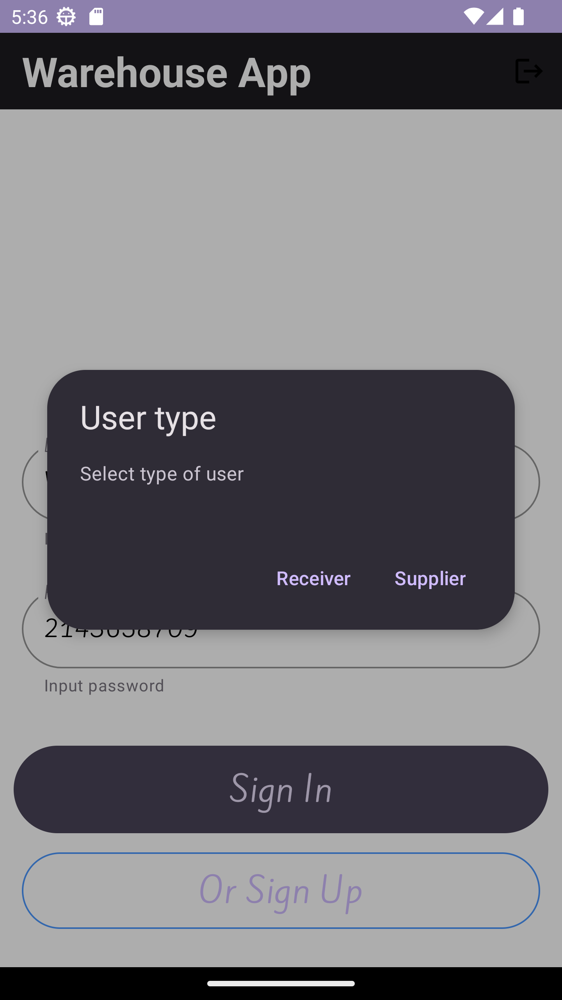
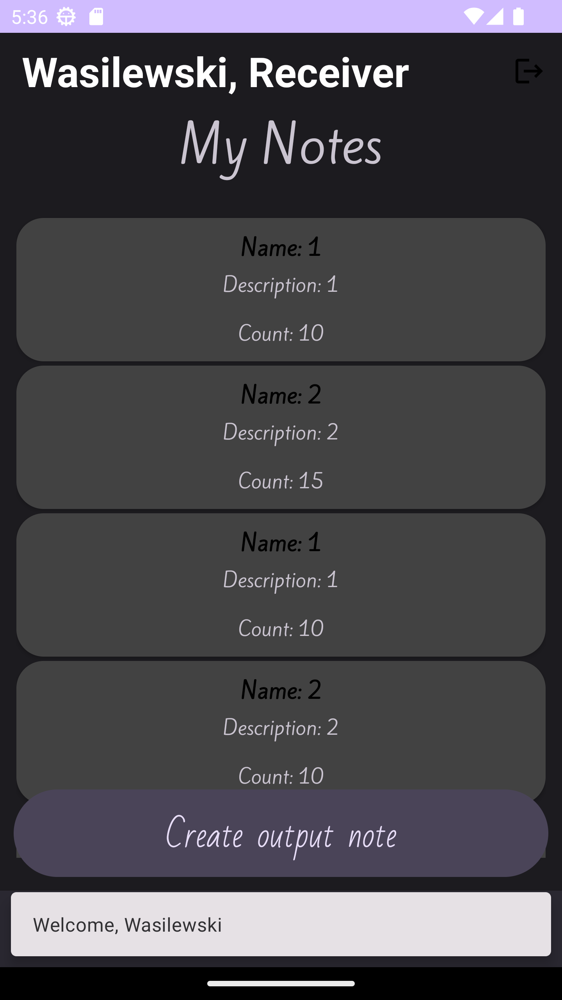
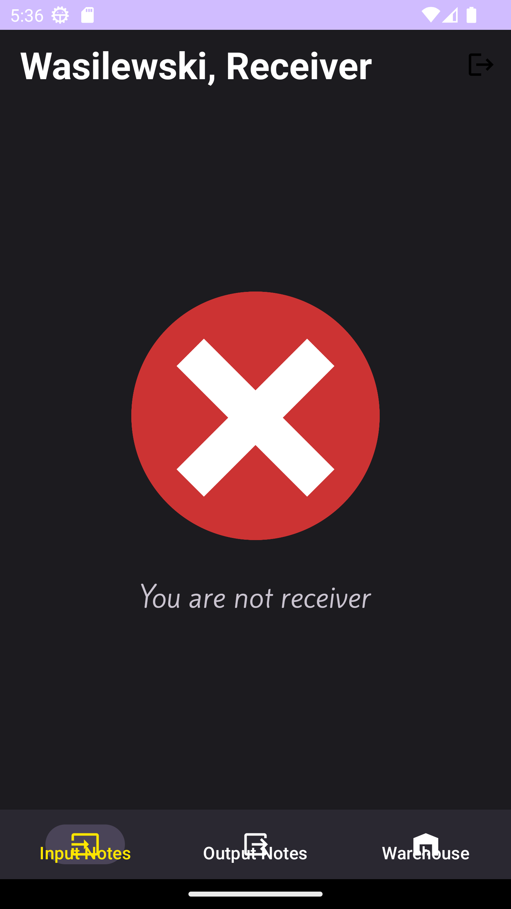
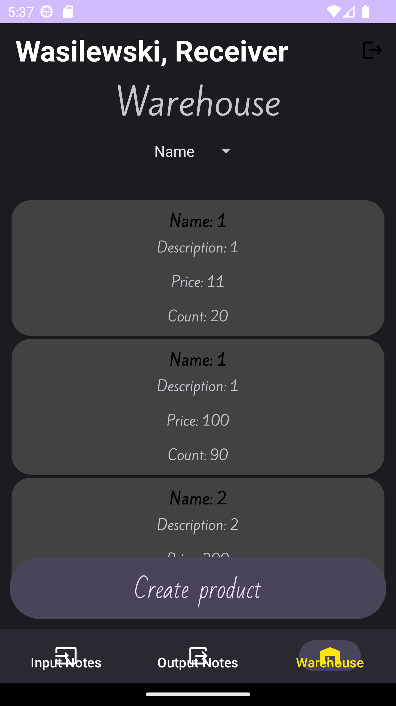
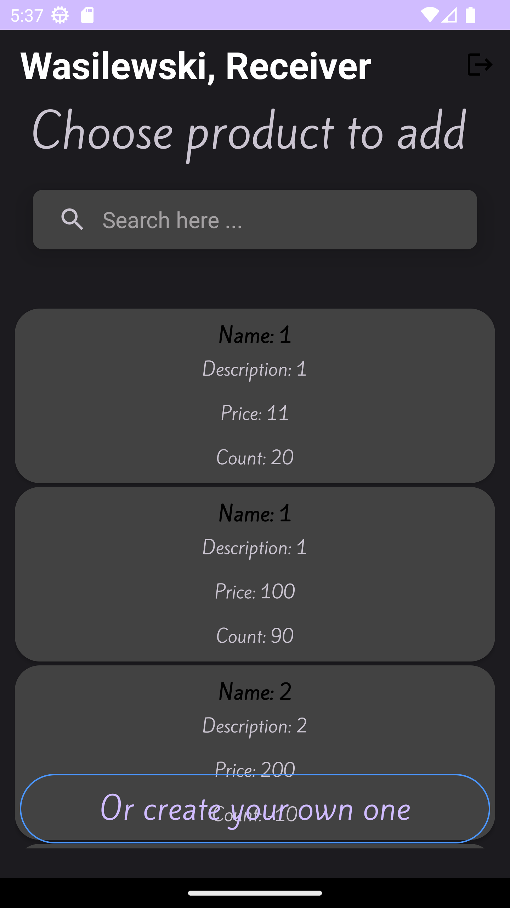
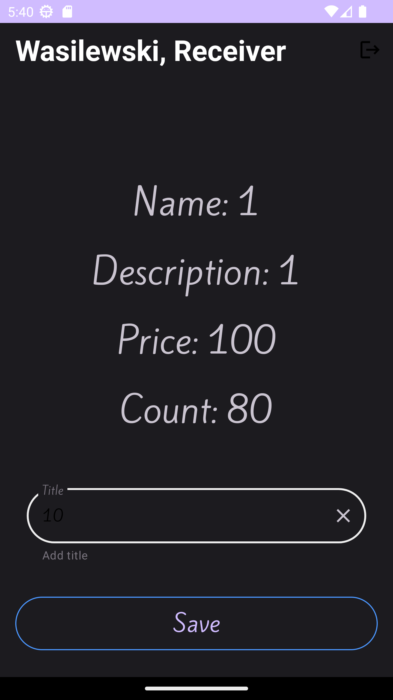
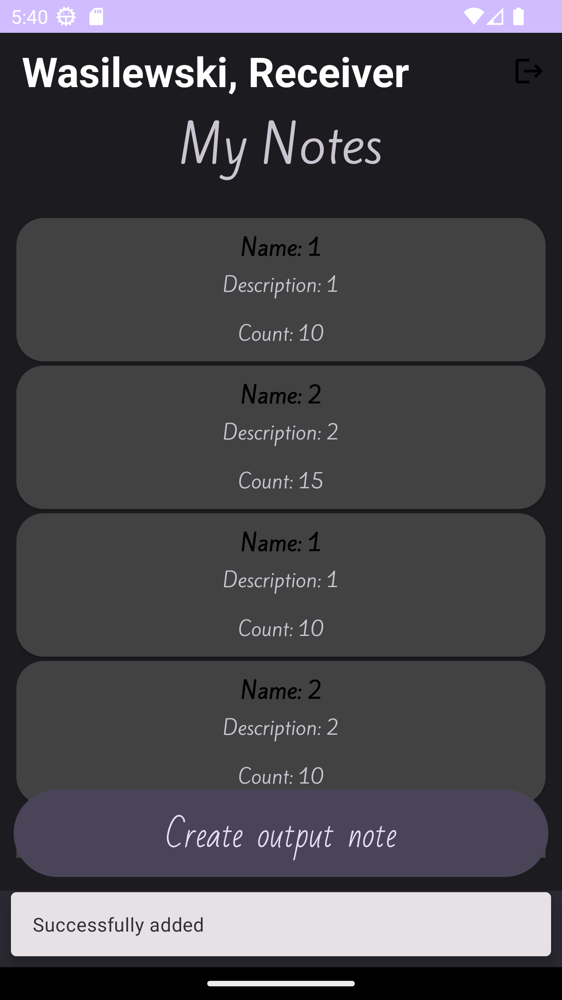
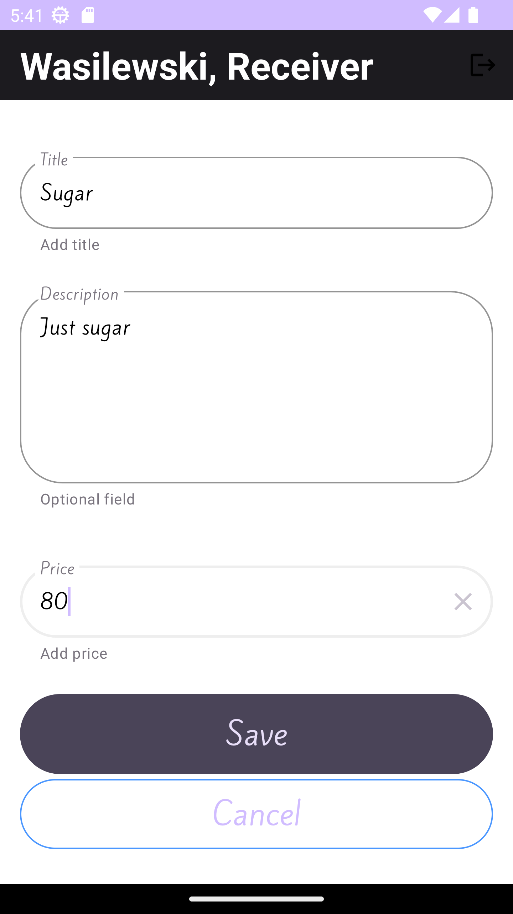
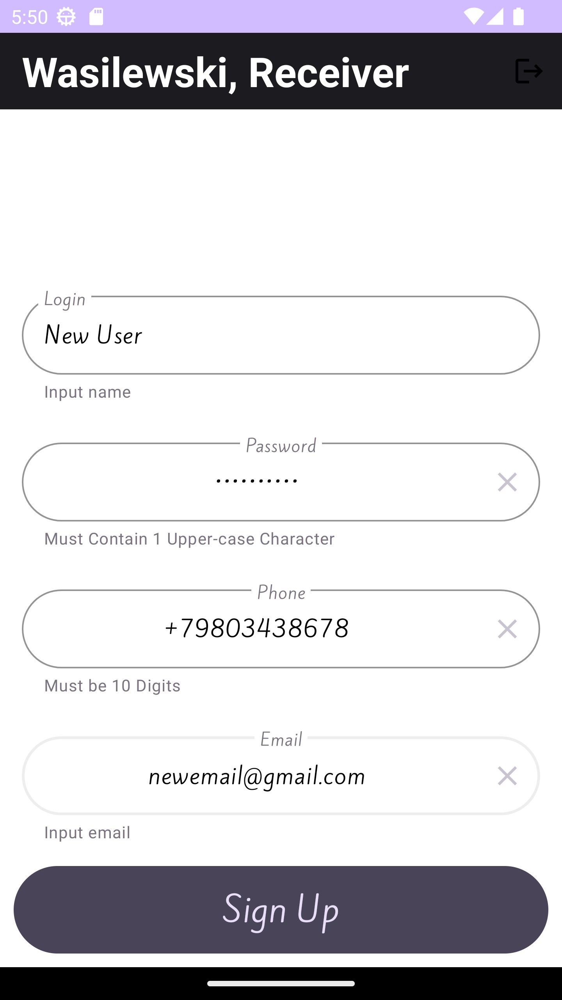

# WarehouseApp

This project is a warehouse application.

The warehouse is a database with one-to-one, one-to-many, and many-to-many relationships.

The database stores information about goods and their quantity in warehouses. It also stores information about users -- users can be recipients and suppliers. By receiving/supplying goods, their quantity in the warehouse changes.

# Features
- MVVM architecture pattern
- Clean Architecture
- Storing data using Room database
- Database with one-to-one, one-to-many, and many-to-many relationships

# Gallery

<li>
  Sign In
</li>
<li>
  
</li>

<li>
  Selecting type
</li>
<li>
  
</li>

<li>
 Notes
</li>
<li>
  
</li>

<li>
  No access
</li>
<li>
  
</li>

<li>
  Products
</li>
<li>
  
</li>

<li>
  Creating note 1
</li>
<li>
  
</li>

<li>
  Creating note 2
</li>
<li>
  
</li>

<li>
  Note added
</li>
<li>
  
</li>

<li>
  Product adding
</li>
<li>
  
</li>

<li>
  Sign Up
</li>
<li>
  
</li>
